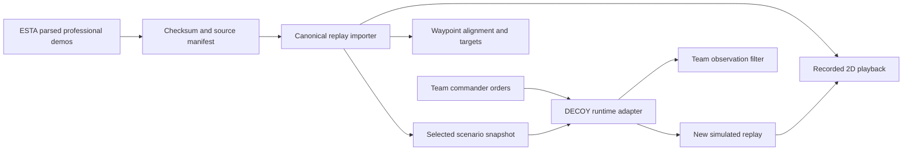

# Architecture and integration boundary

This document describes the existing replay/DECOY implementation. The planned player RL architecture is defined in [RL_TASK.md](RL_TASK.md), with implementation milestones in [TODO.md](../TODO.md); it is not implemented by the commander API below.



## State conventions

Public player and bomb coordinates use CS:GO Hammer units, with Z up. `game` identifies the source rules family; simulation uses `game: csgo`, `source.kind: simulation`, and `source.engine: DECOY`. Privileged replay state is never synonymous with policy observation.

Radar projection is `u=(x+2476)/4.4`, `v=(3239-y)/4.4` for the 1024x1024 pinned Dust II image. DECOY uses meters: multiply XYZ by 0.01905 and add 3.1 to Z; the inverse is explicit. The effective graph includes upstream's manual additions and removals, not only the base waypoint JSON.

Canonical replay root: `schema_version`, `match_id`, `game`, `map`, `source`, `rounds`. Each round contains `number`, `winner`, ordered `frames` and timestamped `events`. Every accepted frame has five T and five CT slots, including dead players. Each has a stable string ID, XYZ, yaw, HP, alive, equipment, and retained source fields. Bomb state distinguishes carried/dropped/planted/defused/exploded/unknown. Unknown data stays null.

The importer handles source `seconds` resetting at plant. Continuous round time is reconstructed from ticks and source tick rate; clocks retain their display-derived precision and uncertainty. It excludes frames outside active rounds and incomplete-roster frames instead of inventing missing players. See DATA.md.

## Commander API

Use `.venv-decoy` with `src` on `PYTHONPATH` (pytest already configures this):

```python
from igl.decoy_runtime import DecoyRuntime

with DecoyRuntime(seed=42) as env:
    state = env.reset(seed=42)
    observation = env.team_observation("T")
    env.command({"T_0": {"type": "hold"}}, team="T")
    state = env.step(0.25)
```

`command` accepts per-slot `hold`, `move` to a waypoint or XYZ, `plant`, and `defuse`. Stationary commands optionally specify `yaw` in degrees to hold an angle. Omitting a bot retains its previous order; dead-bot orders and control of the other team are rejected. The caller supplies orders for both teams or uses the documented scripted systems-test baseline. `step` advances fixed physics ticks and stops on round termination. `reset` resets RNG and round state. `restore` accepts a canonical scenario, validates supported state and records every position snap. Multiple engines are isolated in subprocesses because Panda3D uses global runtime state.

`frame()` is privileged. `team_observation()` returns friends, approximately visible enemies, timestamped last-seen records, limited bomb information, and clock. The approximation has no hearing or smoke model. A demo snapshot starts a new perception history rather than pretending to recover full earlier communication. There is no reward or policy trainer yet.

## Local API

The standard-library server listens on 127.0.0.1 only:

| Endpoint | Result |
|---|---|
| `GET /api/catalog` | Recorded and simulated replay metadata |
| `GET /api/matches/<id>` | Decompressed canonical professional replay |
| `GET /api/simulations/<id>` | Canonical simulated replay |
| `GET /api/map` | Radar image and coordinate metadata |
| `GET /api/scenarios` | Tested sample and candidate count |
| `POST /api/simulate` | Branch from match/round/frame, seed and duration |
| `GET /api/validation` | Existing verification evidence |

The branch request references only indexed local replay IDs, never arbitrary filesystem paths. Duration is limited to 120 simulated seconds, requests are same-origin JSON, and only one simulation runs at a time. Runtime failures are surfaced; full diagnostics are retained locally in `reports/decoy-last-error.log`.

## Next work before RL experiments

The revised recommendation is to evaluate an [original-CS2 backend](ORIGINAL_GAME_BACKEND.md) behind the existing 2D interface before building custom utility. The earlier [utility design](UTILITY_SYSTEM.md) and [reference validation plan](UTILITY_VALIDATION.md) are retained as a paused alternative. These are design documents; the current runtime remains DECOY and still rejects unsupported utility.

Define the supported tactical subset, replace the omniscient test baseline with observation-limited opponents, implement/calibrate required utility, and establish a broader match/event holdout corpus. Only then select rewards and train policies. Current infrastructure demonstrates that real data can be read, mapped, observed, branched and evaluated mechanically; it does not demonstrate that the simulator ranks real-world tactics correctly.
