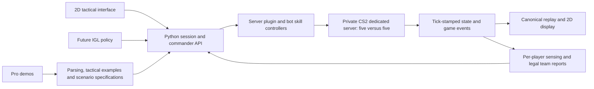

# Original CS2 as the simulation backend

Scope update, 2026-09-23: investigate this backend for a policy controlling one player, with optional IGL communication. The [current task](RL_TASK.md) supersedes the commander learning boundary below. This earlier feasibility proposal is retained for its bridge investigation; its five-player control architecture must be revised before implementation. See [P0 in the roadmap](../TODO.md).

Date: 2026-09-18. Status: revised recommendation and feasibility plan; no CS2 server bridge has been installed or verified in this project.

## Decision to investigate first

Use the original CS2 game as the authoritative simulation backend, retaining our 2D viewer, dataset pipeline and replay format, and adding live IGL controls. The current frontend plays replays and launches a batch branch; it is not yet a live bot-command interface. Pause custom grenade/effect implementation while testing that route. This follows the user's priority of authentic game behavior and their explicit request to pause and reconsider the engine approach.

The earlier DECOY choice favored controllable stepping, inexpensive headless runs and accessible state. Those remain useful properties. However, the utility design exposed coupled fidelity work across geometry, grenade flight, smoke, blindness, fire, combat and bot movement. A two-person project focused on IGL decisions should first test whether a control bridge to the real game can replace that work.

This is a recommendation to prove feasibility, not a claim that the game already offers a complete RL API.

The [archived IGL task definition](IGL_TASK_ARCHIVE.md) records the earlier post-plant/retake scope and proposed fixed-controller boundary. “Fixed controllers” meant execution software we would need to implement or verify; default CS2 bots were not assumed to understand tactical orders.

## Architecture

CS2 handles the game mechanics. Our code handles tactical instructions, bot input, episode orchestration, data collection, observation rules and evaluation. The 2D interface is a projection of live or recorded world state; it does not require a 2D physics engine.

Run server-side bots in one private server instance. A rendered spectator client is useful for development and visual checks; the design does not require ten rendered clients or ten human accounts. Benchmark the actual installed setup before committing to worker counts or headless performance.

## What becomes authentic, and what still needs engineering

| Concern | With the original-game backend |
|---|---|
| Grenade trajectory, bounce, activation and inventory | Resolved by the game when driven through normal player inputs |
| Smoke, flash, HE and fire interactions | Resolved by the installed game build, rather than our guessed formulas |
| Movement, gun mechanics and bomb rules | Resolved by the game for the supported controller actions |
| Utility skill | Still needs navigation, aim, input timing, deadlines and failure handling |
| Bot tactics and execution quality | Still needs controllers; native bots are a baseline, not professional players |
| What the agent may know | Still needs filtering and validation; server state is privileged |
| Arbitrary demo continuation | Still needs scenario reconstruction; a demo is not a full saved server checkpoint |
| RL speed and repeatability | Must be measured; faster-than-real-time stepping and exact resets are not assumed |

Use ordinary bot movement/equip/aim/attack inputs for utility skills. Do not spawn a smoke entity at its requested destination and call that a real throw. The game determines the outcome from the actual launch state. If a bot is at T spawn, a skill requiring long doors must first navigate there.

The engine removes the need to validate a replacement physics model. We still validate that our bridge sends the intended inputs, does not fight native bot AI, respects ownership, reports accurate outcomes, and exposes legal information.

## Candidate integration components

CS2-Bot-Controller documents native bot control, aim/weapon locks, movement recording/replay, and cancellable button injection. Treat it as an input-control component, not an existing high-level tactical or RL environment. Compatibility and the precise control semantics require a running-server check. [Maintainer repository](https://github.com/XBribo/CS2-Bot-Controller)

The inspected v0.6.3 public API exposes button injection/suppression, analog movement overrides and weapon switching, but no direct live view-angle setter. An aim lock is not an aim command. The first prototype must prove a separate angle-input path or add a small explicit bridge extension; movement overrides also do not implement navigation. Pin the source/API/binary versions and verify ABI compatibility on the installed build. [v0.6.3 API](https://github.com/XBribo/CS2-Bot-Controller/blob/v0.6.3/csharp/BotControllerApi/IBotControllerApi.cs)

Its replay helper also corrects grenade birth position/velocity to recorded values. Avoid/disable that alignment for authentic action-driven rollouts: a bad throw must remain a bad throw. Plain replay agreement with such corrections would not establish controller correctness. [Projectile alignment implementation](https://github.com/XBribo/CS2-Bot-Controller/blob/v0.6.3/csharp/BotControllerImpl/ProjectileAlignment.cs)

CounterStrikeSharp provides a CS2 server-plugin framework with player controller/pawn access, event handling and frame/tick scheduling. Its scheduling APIs operate within a running server; they do not by themselves establish external lockstep stepping, fast-forward or complete state snapshots. [Player model](https://docs.cssharp.dev/docs/guides/referencing-players.html), [server scheduling API](https://docs.cssharp.dev/api/CounterStrikeSharp.API.Server.html)

Proposed division: a server plugin samples/acts on the game thread and exchanges bounded messages with the Python coordinator. Background I/O never reads or mutates game entities directly. Choose one coherent movement/aim control path and explicitly suppress competing native AI where required. Keeping native aim/combat/navigation for a baseline is a separate controller mode, with its limits documented.

Do not make an unverified bot-control dependency foundational until a one-bot movement/aim/throw experiment passes on our game build.

## Minimum session contract

The adapter needs these operations, with capabilities advertised rather than assumed:

- `capabilities()`: build, map, bridge versions, supported controls, observations, reset fields, timing mode and limits.
- `reset_scenario(spec)`: reset supported state and return a field-by-field verification report plus a fresh episode ID.
- `submit_orders(episode_id, sequence, team, orders)`: validate ownership and input types; return acceptance/application ticks and per-bot status.
- `observe(team, after_tick)`: deliver timestamped legal observations and explicit event gaps/latency.
- `collect_until(tick_or_terminal)`: collect a bounded action window in a running server. Do not describe this as pause/step unless lockstep behavior has been proved.
- `export_replay()` and `close()`: record outcomes/provenance and clear all pending commands safely across episodes.

Keep a persistent server session; starting CS2 for every action or short episode would waste time. Use bounded queues and idempotent sequence IDs. On missed deadlines, apply a declared neutral/hold behavior and log it. Old-episode commands cannot affect a new episode. Never stall the server tick while Python performs inference.

Begin with real-time, tick-indexed action windows. High-level IGL orders persist while the lower-level controllers act. Later exact-tick control, acceleration and multiple workers are independent capabilities to benchmark, not features implied by having a Python `step()` method.

## Pro demos and reset strategy

Retain pro demos for tactical examples, evaluation situations and future imitation learning. Collect raw CS2 demos separately from the existing historical CS:GO ESTA corpus. Matching map names does not make those states interchangeable.

Begin with explicit clean scenarios: supported positions and facing, health/armor, inventory, teams, bomb phase and time. First use pre-plant scenarios without active effects; add post-plant only after bomb location/timer/reset can be verified. Read back every restored field. Warm-up ticks, spawn protections, frozen states and remaining entities must be controlled and reported.

To study an active utility situation, prefer reproducing a short input sequence in the game so the engine creates its own projectiles/effects. A recorded input sequence can still diverge and needs outcome checks. Arbitrary mid-flight velocities, smoke internals, bot memory, RNG, weapon recovery and animation state are not assumed restorable from a demo frame.

Name the outputs accurately: an exact recorded replay; a constructed scenario inspired by a demo; or a verified partial reconstruction. None automatically means an exact counterfactual branch of the original match. Both teams act in the new episode; future recorded positions must not determine an opponent's response.

## Observation and rendering boundary

Keep omniscient live/replay state for the viewer and diagnostics. The policy gets only modeled player observations and declared friendly communication. Built-in game mechanics do not automatically make a server plugin's full player list a fair observation.

Audit exposed blindness state, smoke-aware visibility, last-seen memory and sound. Server geometry visibility or network transmission is not automatically human visibility through a rendered smoke edge. Prefer suitable engine-provided sensing where its semantics can be verified; otherwise retain a clearly labeled observation approximation and compare it against player-view recordings. A blinded bot must not receive current target coordinates through a shared team/combat shortcut.

This distinguishes mechanical fidelity from sensory and behavioral fidelity. The server supplies the real game; our representation and controllers still define the experiment.

## Reuse of current project

- Retain raw-data manifests/checksums, parsing, stable player identities, timeline playback, scenario provenance and the radar renderer.
- Add a backend/session boundary around the current DECOY-only `bridge.py` and batch `/api/simulate` path. Keep old DECOY replays readable.
- Add live control and observation routes alongside batch replay generation; do not route each live order through a new subprocess.
- Add player selection, move/aim/utility controls and command acknowledgements to the existing viewer. Its present team filter is a friendly-only display mode, not an RL observation implementation.
- Replace the viewer's blanket suppression of utility for all simulated sources with explicit per-backend capability checks. CS2 live/simulated telemetry and DECOY's absent telemetry are different cases.
- Record `source.engine: CS2`, real game/map/bridge builds, episode identity and tick timing; keep uncertainty and missing fields explicit.
- Map support becomes a data/UI integration issue. Dust II is convenient for continuity, but Mirage need not be rebuilt in a custom physics engine. Radar transforms, callouts, demos and recipes still need map-specific setup.
- Select radar/coordinate metadata by game and map build. Preserve the historical CS:GO projection for old replays; neither its image nor the DECOY waypoint graph is certified for current CS2.

## Go/no-go feasibility experiment

Before further custom mechanics work, demonstrate:

1. A private Dust II server runs ten bots with stable external identities and survives repeated clean resets.
2. Independently control one bot, then all five team bots, without unintended native-AI overrides; verify opponent behavior remains independent.
3. A scripted move/hold/aim/throw sequence produces a real smoke and flash through normal player inputs, with equip/inventory changes and actual game outcomes.
4. Stream positions, inventories, grenade/effect events and shot events into the 2D viewer with tick stamps and accurate capability labels.
5. Reject cross-team and stale-episode orders. Verify observation filtering with blinded, smoke-obscured and hidden enemies.
6. Reset the same supported scenario repeatedly, checking every requested field, residual entities and first-action timing. Record variation rather than claiming bitwise determinism.
7. Measure 30–60 second scenarios: reset cost, CPU/RAM, achieved simulation rate, input latency, missed ticks and stability. Only then evaluate multiple workers or acceleration.

If input control works but high-throughput stepping does not, the backend can still serve short tactical training/evaluation episodes. For scale planning, 10,000 episodes of 30 seconds require about 83.3 hours on one real-time worker before resets and overhead. Multiple workers and shorter curricula can help, but actual parallel capacity must be measured. A lower IGL decision frequency reduces policy calls; it does not make the game advance faster.

If the original-game route passes, it becomes the main environment. Keep DECOY as a lightweight engineering baseline or later explicitly approximate surrogate only when measurements justify a need. Avoid maintaining two full game engines by default.

## Current evidence

Repository and maintainer documentation have been reviewed. Existing local code was inspected for migration boundaries. The current DECOY Bullet sweep API was probed successfully, but that is irrelevant to whether a live CS2 control bridge works. No server setup, live bot-control trial, reset benchmark or original-game utility validation has been executed in this decision review.
