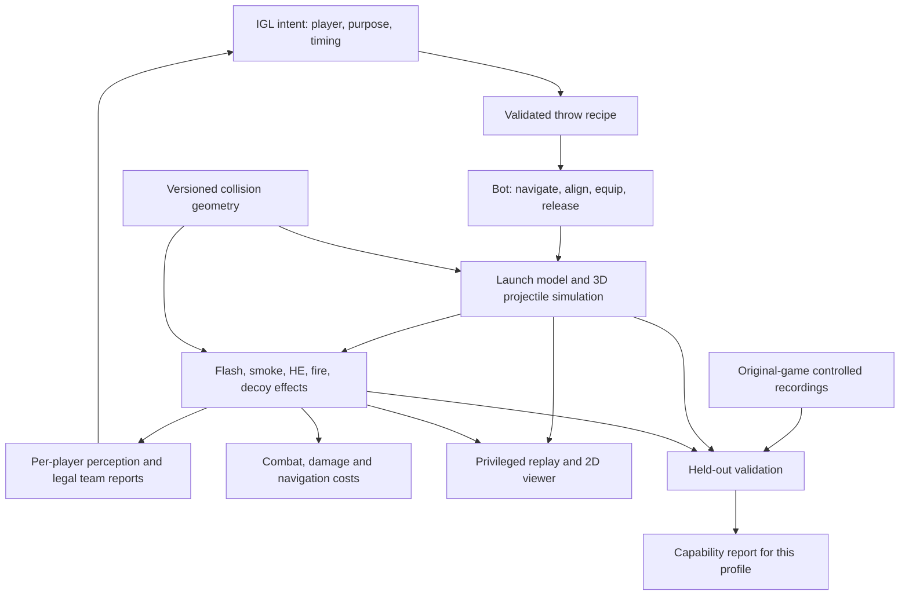

# Utility system design

Design date: 2026-09-18. Status: **custom-engine proposal paused** after the user's request to reconsider the original game as the simulation backend. See [ORIGINAL_GAME_BACKEND.md](ORIGINAL_GAME_BACKEND.md) for the revised recommendation. The material below is retained as an alternative and a record of requirements, not an implementation commitment.

This design targets physically executable, tactically meaningful utility for a five-versus-five IGL environment. The viewer remains 2D; launch, flight, collision, visibility and damage use 3D state. No ML training is part of this work.

The provisional target is **CS2 on a pinned Dust II build**. The existing CS:GO DECOY map and ESTA corpus remain a separate engineering prototype. No cross-game fidelity is claimed. The original-game feasibility study takes precedence over implementing the custom solver below.

## 1. Recommended architecture

Build a small, calibrated projectile simulator using Bullet's collision queries, then connect it to effect models, bot execution and a shared perception/combat boundary. Validate against controlled recordings from the original game. A throw library provides aiming instructions; it never supplies the actual outcome.



Use two implementations behind a common measurement contract:

- **Reference:** a local/private instance of the chosen game supplies real throws, effects and player views. Manual repeatable capture is acceptable initially. An automated server bridge is a later integration, not a dependency assumed to be working.
- **Fast simulator:** our headless runtime reproduces only capabilities that have passed comparison with the reference. Unsupported interactions remain explicit. If a required tactic cannot pass, evaluate it in the reference game or exclude it from that experiment.

The original game provides measured behavior; Bullet provides useful numerical and geometric machinery. Generic rigid-body defaults are not Counter-Strike rules.

## 2. What can be reused and what must change

| Existing component | Reuse | Required work |
|---|---|---|
| Panda3D/Bullet world | Static collision queries and headless operation | Audit grenade collision geometry, masks and narrow gaps |
| 60 Hz synchronous runtime | One authoritative simulation clock | Explicit event ordering, utility substeps and effect updates |
| Commander ownership and stable identities | Team authorization and ten persistent slots | Utility orders, reservations, action progress and pitch |
| Waypoint navigation | Travel toward a launch region | Local collision-checked placement; never snap into a lineup |
| Team observation API | Public/privileged separation | Per-player sensing, smoke, blindness and causal sound reports |
| Learned combat model | Optional baseline for ordinary visible engagements | Shared perception gate and explicit unsupported combat interactions |
| Canonical replays and viewer | Playback, provenance and coordinate projection | Typed simulated projectiles/effects with real identities and capability metadata |
| ESTA pro data | Candidate tactics and historical context | New high-resolution reference captures for physical calibration |

Current limitations are recorded in [DECOY_AUDIT.md](DECOY_AUDIT.md). The existing map is a triangle mesh assembled from rendered FBX geometry, with no precise upstream game revision or per-surface gameplay semantics. This cannot establish CS2 grenade collision fidelity. Current visibility rays also do not provide calibrated player eye positions. These are first-milestone checks, not details to defer until after training.

## 3. Profiles, units and reproducibility

Each result binds to an immutable `rules_profile_id` containing:

- Game family, build/ClientVersion, map package and collision checksums, coordinate transform, relevant server settings, mode and capture environment.
- Launch, projectile, detonation, inventory, flash, smoke, damage, fire and sound model revisions with their parameters.
- Parameter provenance: measured, externally documented, estimated, or unknown; fitting data IDs and uncertainty bounds.
- Numerical step configuration, software revisions, geometry feature coverage and the validation report hash.

Unknown required parameters do not receive silent defaults in validated mode. Development profiles may contain estimates but must be labeled `experimental`. A profile is not validated merely because its JSON schema is valid.

Public state uses Hammer units, seconds, degrees, and XYZ with Z up. The current DECOY point transform is:

```text
p_engine = 0.01905 * p_world + (0, 0, 3.1)
v_engine = 0.01905 * v_world
a_engine = 0.01905 * a_world
```

Offsets apply to points only. Convert yaw/pitch through a tested adapter; do not assume Source and Panda angle conventions match. Distinguish feet, capsule origin, eyes and release origin explicitly.

The existing Bullet world gravity is -9.81 in engine coordinates, about -515 Hammer units/s² under this conversion. That is a description of the prototype, **not a calibrated grenade parameter**. Grenade gravity must be profile-specific; do not modify player gravity to tune grenades.

CS2 collision assets can be obtained and pinned by ClientVersion using Awpy's documented asset pipeline. Independently test whether the supplied mesh covers the collision types required by our throws; a visibility mesh alone does not certify grenade clips, player collision, breakables or material rules. [Awpy visibility and assets](https://awpy.readthedocs.io/en/stable/visibility.html)

## 4. Commands and bot execution

Keep three interfaces distinct:

1. **Tactical intent:** player, utility purpose, target sector/sightlines, desired effect window, synchronization group and deadline. For example, support a long entry with a flash. The target is a goal, not a detonation coordinate.
2. **Skill execution:** a named recipe resolves the intent into a launch region and executable movement/aim/input sequence. Multiple recipes may achieve the same purpose from different positions.
3. **Physical input:** aim, movement, equip/prime/release buttons and duration. The simulator derives release state from the player's actual state. This also permits future low-level bot learning.

Illustrative future API; it is not accepted by today's runtime:

```python
env.command({
    "T_2": {
        "type": "utility_skill",
        "command_id": "round-8-order-14",
        "skill_id": "d2.long.entry_flash.01",
        "deadline_seconds": 42.0,
        "sync_group": "long-entry-1",
    }
}, team="T")
```

Recipe fields include profile hash, grenade kind, launch region and height, position/velocity/aim tolerances, stance, required movement abilities, equip and input sequence, tested outcomes, timing distribution and permitted dynamic-world conditions. Store Molotov and incendiary as distinct kinds even when the UI groups their inventory.

Bot state transitions:

```text
accepted -> navigating -> aligning -> equipping -> priming -> released -> recovering -> complete
                    \-> failed / cancelled / deadline_missed
```

Readiness is checked again at release. Start with stationary throws; run, crouch and jump recipes are unavailable until those player movement capabilities exist and pass validation. A waypoint near a lineup does not satisfy its exact launch constraints.

Repeated `command_id` submissions are idempotent. Reserve an item during preparation without duplicating it. Transfer ownership from inventory to an in-flight entity exactly once at the profile-defined release event. Cancellation/death before release follows the measured pin/equip rules; after release the projectile continues independently of the thrower. No command can recall it. Grenade equip/recovery occupies the weapon channel and prevents simultaneous firearm use.

Legal action masks depend on own state, inventory, supported skills, known geometry and own observations. They never depend on hidden enemy position or whether an unseen enemy would be flashed. A high-level order can include travel; a direct throw uses the current physical pose and cannot teleport to its desired destination.

Synchronization uses friendly readiness reports and a release schedule, with timeout/failure handling. A flash's flight time is included in the entry timing. The IGL receives execution status, not guaranteed tactical success.

## 5. Projectile physics

### Collision-assisted solver

Use a small explicit projectile solver with **Bullet convex sweeps** for the first implementation. This gives us control over launch, gravity and bounce rules while reusing the map's acceleration structures. A rigid body with CCD remains an alternative to benchmark; do not run both solvers on one projectile.

Bullet supports moving convex shapes through the collision world, returning hit position, normal and fraction. This is suitable for testing a grenade-sized hull across a step rather than checking only its endpoint. [Panda3D Bullet queries](https://docs.panda3d.org/1.10/python/programming/physics/bullet/queries)

For a constant-acceleration free-flight segment, the initial candidate model is:

```text
v0 = calibrated_throw_vector(aim, strength, stance) + calibrated_velocity_inheritance(player_velocity)
p1 = p0 + v0 * dt + 0.5 * gravity * dt²
v1 = v0 + gravity * dt
```

These equations specify our starting approximation, not a recovered Source implementation. Test another integration scheme if the reference shows consistent disagreement.

Each step must:

1. Sweep the release hull from the appropriate player origin to the proposed release point, applying a measured launch-clearance rule. Reject invalid initial overlap rather than spawning through a wall.
2. Sweep from the current projectile location to the free-flight candidate using the correct collision mask. Bound curvature error by subdividing the step.
3. Advance the projectile center using the hit fraction (Bullet's contact position is the surface point, not the center), use the velocity at contact, and apply profile-specific normal restitution, tangential response and rest thresholds.
4. Consume the remaining time and check for additional contacts. Bound work per step; overflow is a recorded simulation failure, never a silent teleport or discarded collision.
5. Evaluate detonation/activation predicates at the appropriate event time. Resting projectiles retain timers; activation is not inferred from a visual icon or an entity-destroy callback.

Do not add arbitrary aerodynamic drag, spin effects or randomness merely to look realistic. Add them only when reference error justifies them. Deterministic error cannot be fixed by injecting noise. Execution variability, if later desired, is sampled separately from measured input tolerances and recorded with its seed.

### Timing and collisions

Keep the current 60 Hz host clock initially. Begin experiments with four projectile slices per host step (240 Hz), then compare with finer slices and the reference. This is a numerical proposal, **not CS2's tick or sub-tick model**. Preserve finer release/event timestamps when available, and document host-clock quantization when unavailable.

Call the existing player/world physics advancement only once per host step. Projectile sweeps do not advance the shared Bullet world again. Moving player/projectile contacts need swept relative motion against start/end player poses; treat them as unsupported until implemented, rather than colliding against an arbitrarily stale capsule. A geometry-only milestone is restricted to scenarios without such contacts.

Separate collision layers for grenade flight, visual occlusion, blast queries, players and special volumes. A surface may behave differently for a ray, a grenade and a player. Unknown material/clip/breakable rules invalidate affected reference cases. The first validated subset excludes changing geometry; later support requires stateful breakables/doors, not static mesh edits applied globally.

Fast projectiles must be tested against thin obstacles. If using the rigid-body alternative, CCD must be explicitly configured; Bullet's documentation explains that ordinary discrete collision checks can miss them. [Panda3D CCD](https://docs.panda3d.org/1.10/python/programming/physics/bullet/ccd)

## 6. Effects

Effects are authoritative simulation state. Rendering samples them; it never decides who is blinded, damaged or concealed.

### Flash

At detonation, evaluate each living player's eye position and 3D view vector at that time. Inputs to a calibrated response model are distance, viewing angle, geometry visibility/partial cover, existing blindness, and supported environmental interactions. The outputs are an intensity/recovery curve and observation degradation over time. Looking away must not be hardcoded to imply zero effect.

Use a small bounded parameter model or lookup table fitted to controlled measurements. A simple eye ray is the first geometric feature; additional samples for partial cover are a candidate approximation to compare, not an asserted game formula. Measure stacked flashes, smoke interaction and obstruction separately.

Store a temporal blindness state, not only `blind_until`. Full blindness prevents new visual enemy updates; partial blindness needs a declared, tested sensing approximation. Previously known positions remain timestamped memories. The bot may continue an existing move or input while blind. It cannot acquire current hidden coordinates through combat or through shared team state. Sound remains a separate channel, with any flash-induced sound change explicitly modeled or excluded.

### Smoke

Represent smoke as a local sparse **3D density field** with growth, occupancy constraints and decay. A ray integrates density to obtain an opacity/transmittance proxy. Calibrate the threshold for enemy visibility using controlled player-view captures. Density rendering alone does not prove the game uses our model.

Prevent expansion through solid walls and between disconnected spaces. Test doors, corners, elevations, edges, multiple overlapping clouds, and observers inside smoke. Use a local grid only around active clouds; compare spatial resolutions before selecting the validated profile. Renderer randomness must not move authoritative visibility boundaries.

For CS2, smoke interactions with gunfire and explosions require a separate calibrated stage. Valve describes its smoke as volumetric and responsive to these interactions. A clipped static volume is an explicit early approximation. [Valve CS2 overview](https://www.counter-strike.net/cs2)

The current combat model has no individual bullet events or paths. Consequently it cannot drive authentic bullet holes in smoke. A profile supporting that interaction requires an explicit shot/path backend. Do not fabricate a bullet ray from the viewer's yaw marker or apply smoke clearing on a damage-model call. Until supported, experiments relying on that interaction are excluded from validated CS2 claims.

### HE

Use the actual detonation location and a versioned blast/damage response calibrated across distances, cover, stance and armor. Multi-point blast visibility can be tested as an approximation; it must not be assumed to reproduce the original game's damage tracing. Preserve numeric armor and armor depletion, self/friendly damage settings, ownership after thrower death, and simultaneous damage attribution.

HE effects on smoke or breakables are separate capabilities. Missing capabilities do not silently become a generic spherical effect through walls. Validate health and armor loss independently.

### Molotov and incendiary

Maintain separate rules for launch, surface/air activation, lifespan, spread and damage. Represent fire on connected surface patches with height and slope; use area, connectivity and traversable adjacency rather than a single radar circle. Measure spread, overlap, damage cadence, step-in/step-out behavior, smoke extinguishing and other supported interactions.

Fire changes navigation cost and player damage, not physical map solidity. Bots may choose to cross it. Do not automatically route perfectly around unseen enemy fire. Molotov and incendiary must not inherit identical behavior from the UI's combined `fire` inventory label. Valve has changed incendiary spread and duration in updates, illustrating why the profile must name a build. [Valve, Fire Sale, May 23 2024](https://store.steampowered.com/news/posts/?appids=730&enddate=1716499920&feed=steam_community_announcements)

### Decoy and utility sound

Implement activation, emission pattern, lifetime and any terminal behavior from the selected reference build. Sound reports need propagation/occlusion assumptions, hearing range and uncertain localization. The policy receives an audible cue, not a guaranteed enemy identity or the privileged decoy entity position. A decoy has no tactical purpose in a profile without hearing; mark it unavailable until the hearing contract is supported.

### Inventory and interactions

Counts, carry limits, acquisition/drop/pickup, death handling, equip timings and throw strengths belong to the profile. Unknown recorded inventory is not zero. Dropped inventory items and thrown projectiles are different entity states. Test their interactions only where supported by the chosen build.

Keep a capability matrix covering smoke/fire, smoke/flash, HE/smoke, gunfire/smoke, utility/player contact, utility/breakables and simultaneous activations. An omitted interaction must be reported in scenario validity and evaluation; every effect cannot be validated independently while ignoring interactions the scenario actually uses.

## 7. Shared perception, combat and time

Introduce per-player `PerceptionState`. The shared geometry/effect service answers visibility, smoke transmittance and blind-state queries consistently for observations and combat. Team reporting combines legal individual observations with an explicit communication policy. A teammate seeing an enemy does not grant a blinded shooter's aim access to the enemy's exact current position.

The present learned damage predictor uses geometric LOS every 0.5 seconds and accepts privileged opponent state. It must not continue running unchanged behind new smoke/flash visuals. For the first restricted combat profile:

- Permit an ordinary targeted attack only when the attacker can currently acquire the target under the declared perception model, has a firearm ready and is not in utility equip/recovery.
- Use a measured/calibrated treatment for partial blindness and exposure duration; an arbitrary damage multiplier is not a validated flash model.
- Mark blind fire, smoke spam, wall penetration, explicit bullet/smoke holes and realistic aim recovery unsupported until there is an action-driven shot model. Full blindness blocks acquisition, not the physical possibility of firing. The restricted backend cannot represent that firing behavior and must say so.

This restriction permits isolated effect tests immediately, but limits what integrated tactical conclusions are justified. If the desired experiment depends on smoke spam or blind firing, replace the combat backend or use the original-game reference backend for that evaluation.

Choose one documented scheduler. At each host boundary: accept commands, resolve events due at that timestamp against pre-event state, apply simultaneous health/status changes, cancel dead/interrupted actions, then advance the following interval. Within it, process releases, collision contacts, detonation and expiry chronologically. Resolve events at the same timestamp from one snapshot with a stable tie policy, including release versus death and smoke activation versus flash. Unknown engine tie behavior remains an explicit approximation to validate.

Accumulate exposure over each combat interval. Do not infer that a player had half a second of visibility just because smoke expired at the final sample. Integrating fractional exposure into the old damage model is itself an unvalidated approximation until checked. Utility damage is applied at its own event times; deaths must invalidate later scheduled actions. Stop at the first terminal round event; post-round visuals may be separate from gameplay.

`team_observation()` becomes read-only. Update sensing/history during simulation, not when an agent polls the API. Ten reads at the same timestamp must not alter state, consume RNG or change a later rollout.

## 8. State, events, replay and restore

Use separate versioned contracts for simulation checkpoint, replay and policy observation. A viewer frame is not a resumable physics checkpoint.

| Record | Required information |
|---|---|
| Projectile | Stable instance ID, kind, owner/team, actual pose/velocity, release time, fuse/activation state, profile, simulation status |
| Effect | Stable ID, linked projectile, kind, creation/expiry state, geometry/density/patch state or deterministic reconstruction inputs |
| Player utility | Counts and certainty, equipped item, reservation/action stage, pitch/eye pose, blindness curve, armor and recovery state |
| Event | Monotonic sequence, simulation time and source time when applicable, actor/object IDs, event kind, payload and provenance |
| Checkpoint | All of the above plus bot orders, queues, movement, RNG, clock residuals, perception memories, dynamic geometry and checksums |

Simulated IDs use episode identity plus a monotonic counter. Imported entity indices require serial/generation and demo/round context to avoid reuse. Preserve 64-bit external IDs as strings. Events include release, contact, detonation, effect changes, exposure/damage, inventory transfer and command failure. Privileged logs can report all affected players; policy events cannot reveal hidden victims or precise enemy inventories.

Make utility a versioned additive replay extension with capability metadata. Old recorded replays remain readable, unknown fields remain unknown, and old simulated replays remain utility-unavailable. Update `schema.py` and viewer telemetry deliberately; do not merely populate today's empty arrays and claim all utility exists. Display validated smoke/fire cross-sections separately from decorative effects. Keep replay interpolation outside policy observations.

Strict restore requires known inventory, projectile velocity/timer/identity, effect age/state, player blindness and profile/geometry compatibility. Sparse ESTA snapshots lack enough information for arbitrary active-utility restore. They remain rejected in strict mode. An exploratory reconstruction must record uncertainties and cannot enter validated evaluation. Only a complete simulation checkpoint promises deterministic continuation on the tested platform.

## 9. Code organization and implementation sequence

Proposed new modules, not files already implemented:

```text
src/igl/utility/
    profiles.py       # rules, parameters, provenance, capability checks
    types.py          # input, projectile, effect, event and checkpoint contracts
    geometry.py       # Bullet query adapter, transforms, masks, surface metadata
    projectiles.py    # launch, sweep, contact, activation and lifecycle
    effects.py        # flash, smoke, HE, fire and decoy models
    execution.py      # recipes, inventory reservation and action state machine
    perception.py     # per-player sensing and shared visibility queries
    reference.py      # original-game capture import and comparison
```

Integrate through the adapter rather than editing the pinned vendor checkout. `reset`/`close` clear all objects, queues and reservations. `command` validates/stages utility orders atomically with existing orders. `step` owns all state advancement. `frame` exports privileged replay. `team_observation` projects legal immutable observations. `restore` distinguishes checkpoints from incomplete demo frames. Viewer and server advertise exact capabilities rather than one global `utility_supported` flag.

| Stage | Deliverable | Exit condition |
|---|---|---|
| A: reference and geometry | Pin one build, capture protocol, verified launch/eye coordinates and representative collision probes | Reference measurements and geometry agree for the selected subset |
| B: projectile core | Stationary release, inventory lifecycle, gravity, bounce and per-kind detonation | Analytic/numerical checks plus held-out real-game flight cases pass |
| C: one flash and one smoke | Actual effect state, legal sensing, 2D display, replay/restore tests | Controlled effect cases pass; development visuals cannot substitute |
| D: bot integration | A small recipe catalog, travel/alignment, synchronization, failure handling and restricted combat | Wrong-origin, blinded-combat and hidden-information regressions pass |
| E: broader utility | HE, distinct fires, interactions, hearing/decoy and extra movement skills | Each capability passes its own reference cases before becoming available |
| F: experiment readiness | Holdouts, capability filters, performance benchmark, fair opponent and approximation sensitivity | Declared tactical subset has evidence; no blanket CS2 equivalence claim |

For two people: one owns simulation/execution/perception, the other owns reference capture/data/validation. Agree on the measurement contract first. Build one end-to-end throw before expanding utility types. Work estimates should be revised after geometry and capture feasibility; previous conversational estimates were planning ranges, not a delivery commitment.

See [UTILITY_VALIDATION.md](UTILITY_VALIDATION.md) for the capture protocol, acceptance criteria, reference dataset and first engineering milestone.
